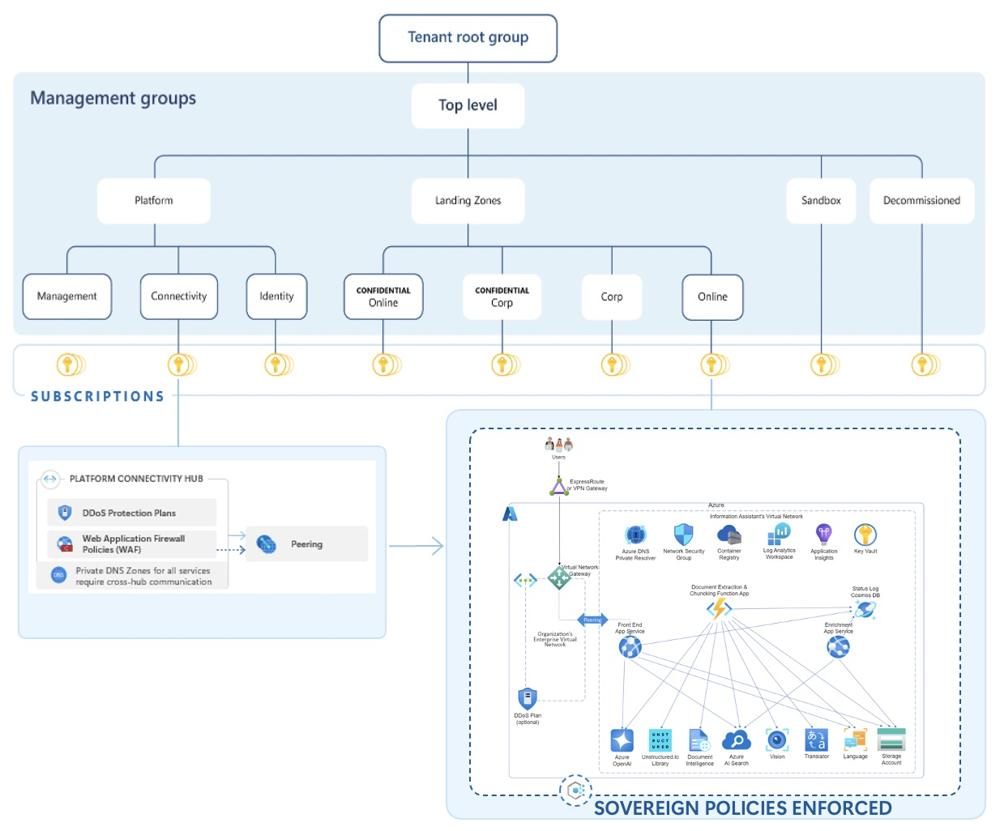

# Enabling Compliant AI for the Norwegian Public-Sector: A Case Study of Microsoft Cloud for Sovereignty


## Project Description 
Artificial Intelligence (AI), in particular Large Language Models (LLMs), offers potential to improve Norwegian public-sector operations. However, adoption is challenging due to strict requirements for regulatory compliance, security, and data sovereignty, especially when using cloud platforms managed by non-European providers. Solutions like Microsoft Cloud for Sovereignty (MCFS) have emerged to address these needs by providing a framework for compliant cloud usage. 

This repository covers both how to set up the the Public Sector Information Assistant in secure mode and how to integrate it with the Sovereign Landing Zone.



## Repository Layout

This repository is organized into the following main directories:

- **`pubsec-info-assistant/`** - Contains the Public Sector Information Assistant application, a RAG-based AI assistant built on Azure OpenAI. This includes the frontend, backend, infrastructure-as-code (Terraform), deployment scripts, and documentation for setting up the assistant in secure mode.

- **`sovereign-landing-zone/`** - Contains the Microsoft Sovereign Landing Zone infrastructure templates and configuration. This provides the foundational Azure architecture for sovereignty compliance, including network isolation, policy enforcement, and security controls.

- **`initiell_test/`** - Initial testing setup for Azure OpenAI integration. Contains a minimal Terraform configuration and test scripts for validating basic OpenAI functionality in Azure before full deployment.

### Technologies 

## Prerequisties


## How to access the Azure VM
This assumes Mac OS.

Download the `PubSec-Assistant_key.pem`-key. Say it ends up in the Downloads-folder. Then, from the terminal, run:
```bash
mv /Users/<your_username>/Downloads ~/.ssh
```

Now run: 
```bash
chmod 400 ~/.ssh/PubSec-Assistant_key.pem
```

Finally:
```bash
ssh -i ~/.ssh/PubSec-Assistant_key.pem azureuser@<YOUR_AZURE_VM_IP>
```

Now you should be inside the VM in your terminal. For a nicer developer experience, you can also connect to SSH in VSCode. For this you will need to have Remote-SSH installed. 

Please see the `README_INTERNAL.md` inside the `pubsec-info-assistant`-folder for guidance on how to deploy the pubsec-assistant.

## Team 
This research project is the concluding thesis for the Bachelor Program in Digital Infrastructure and Cyber Security at the Norwegian University of Science and Technology (NTNU) and is created by Ingunn Tonetta Erdal, Folke Jernbert, Eva Stamatovska and Maren Landro. It is created in collaboration with Tietoevry Tech Services. Thank you to everyone who contributed their hard work and dedication to making this project possible, and for the time and effort they have invested in us. 